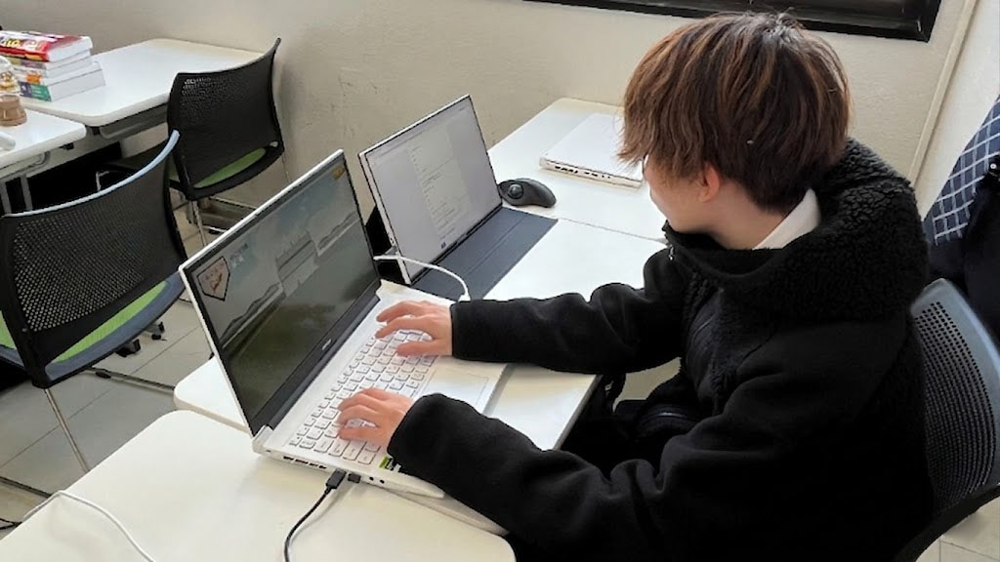
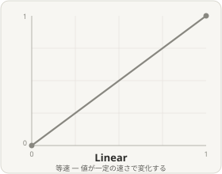
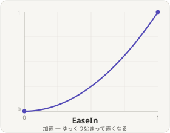
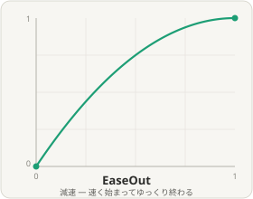
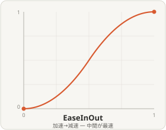
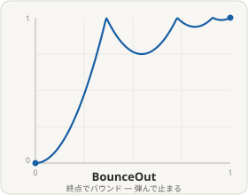
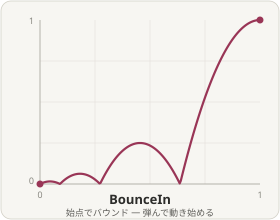

<link rel="stylesheet" href="style.css">
<br>

# **ゲームプログラマーポートフォリオ**   
<br>
<br>

# 目次
- [**1. 自己紹介**](#1-自己紹介)
- [**2. ゲーム紹介**](#2-ゲーム紹介)
- [**3. 作品概要**](#3-作品概要)
- [**4. 担当コード**](#4-担当コード)
- [**5. 技術的アピール**](#5-技術的アピール)
  - UIパーツとLayout & Menuの構造
  - UIAnimation & Curve
  - UIAnimationSeqeunce
  - CircleGauge
- [**6. UIのこだわりポイント**](#6-UIのこだわりポイント)
  - MiniMap
  - SoundOption
  - CountDown
<br>
<br>

## **1. 自己紹介**
| 項目 | 詳細 |
| :--- | :--- |
| **名前** | 忽那 悠生(くつな はるき) |
| **学校** | 河原電子ビジネス専門学校　ゲームクリエイター科 |
| **メール** | **ca01254007@st.kawahara.ac.jp** |

### **自己PR**



ゲーム制作への熱量には自信があります。平日も遅くまで制作を続けるほどゲームづくりが好きで、能動的に動くことを大切にしています。言われたことをこなすだけでなく、自分から課題を見つけて取り組む姿勢を持っています。

- **オンオフの切り替えが得意**　趣味のサッカーやバスケなどスポーツで気分をリフレッシュすることで、制作に向かうときは全力で集中できます。
- **コミュニケーション力**　初対面の相手でも物怖じせず話せるため、チーム制作でも積極的に意思疎通を図れます。
- **好きなゲームはアクション**　「Ghost of Tsushima」のような没入感のある体験に強く惹かれます。プレイヤーとして感じたゲームの面白さをそのまま自分の制作に活かしたいと思い、日々プログラミングに取り組んでいます。


---
<br>
<br>

## **2. 作品概要**

| 項目 | 内容 |
| :--- | :--- |
| **タイトル** | PENTAKT(ペンタクト) |
| **ジャンル** | 3Dアクションゲーム |
| **制作人数** | 4人 |
| **制作期間** | 2026年4月 ~ 現在 |
| **プレイ人数** | 1人 |
| **対応ハード** | PC(Windouws11) / Xbox コントローラー |
| **使用言語** | C++ |
| **エンジン** | BeastEngine(学内製エンジン (k2EngineLow) / DirectX12) / Visual Studio 2026 / VisualStudio CodeAdobe / Pthoshop 2026 |
| **仕様ツール** | 3dsMax / Effekseer / GitHub / Fork |
| **GitHub URL** | https://github.com/TakebayashiNaoya/ProjectBeast |

---
[目次に戻る](#目次)
<br>


## **3. ゲーム紹介**  
「たくさん救いたい、でも見つかりたくない！」天敵の猛追を切り抜ける、ハイリスク・ハイリターンな3Dチェイスアクション！
本作は、親ペンギンを操作し、制限時間内にフィールド上にはぐれた子ペンギンたちを救出してハイスコアを目指す3Dアクションゲームです。
【本作のウリ：可愛さと煩わしさが生むジレンマ】救出した子ペンギンたちは親の後ろをゾロゾロとついてきます。集めるほどに見ためは愛らしくなりますが、天敵「シロクマ」に見つかるリスクや、引き連れる煩わしさ（コントロールの難しさ）が増大していきます。
【ハイスコアを狙う、スリリングなアチーブメントシステム】単に逃げるだけでなく、「あえて眠っているシロクマを起こす」「複数頭のシロクマにあえて追われる」といった、危険な条件（アチーブメント）を達成するほどスコアが跳ね上がります。安全地帯である「かまくら」すらもシロクマに破壊される極限状態の中、極限の「欲」と「割り切り」の立ち回りが試されるゲームです。

---
<br>
<br>

# **4. 担当コード**
### **UI**
  - **UIParts**
  - **MenuBase**
    - TitleEventMenu
    - SoundOptionMenu
    - CountDownMenu
    - MiniMapMenu
    - SearchMenu
    - PauseScreenMenu
    - EnemySleepingMenu
    - PBWakingUpTimerMenu
    - InGameTimerMenu
  - **Layout** 
  - **UIAnimationTypes**
  - **Types**
- **UIAnimation**
    - UIAnimationParameter
    - UIAnimationFactory
    - UIAnimation
- **UIStatus**
  - SearchStatus
- **UIAnimationStatus**
  - PBWakingUpTimerAnimStatus
- **UIAnimationParameter**
  - MasterPBWakingUpTimerParameter
  - SearchParameter
### **Util**
  - Curve
### **Shader**
  - Circlegauge

---

<br>

# **5. 技術的アピール**
## **UIパーツとLayout & Menuの構造**    
UIの配置・スケール・カラーといった静的な情報はすべてJSON側に持たせており、`Layout`クラスがそれをパース（変換）して`UICanvas`に`UIParts`を生成する機構になっています。MVPパターンを用いて、UIが背負う責務を分離する設計にしました。

**① 外部ファイル（JSON）でUI構築が可能**  
UIの配置・サイズ・カラーといったパラメーターはすべてJSONで管理しています。`InGameTimer.json`を例にすると、`UIIcon`や`UIDigit`といったパーツの種類・座標・スケール・色をJSON上で宣言するだけで、`Layout::Reload()`が自動的に`UICanvas`へパーツを生成します。プログラマー以外のメンバーもJSONを編集するだけでUIを調整できる構造です。

**② ホットリロードによる高速な開発イテレーション**  
`Layout::Update()`内では`stat()`でJSONファイルのタイムスタンプを監視しており、ファイルが更新されると自動で`Reload()`が呼ばれます。デバッグ実行を止めてコードを書き直して再ビルドする手間がなく、ゲームを動かしたままUIの見た目を即座に確認できます。なお、この機能は`#ifdef APP_DEBUG`のプリプロセッサで管理されており、リリースビルドには余分なオーバーヘッドが生じない設計になっています。

**③ ホットリロード時の差分更新**  
`Reload()`では既存のUIキーが存在する場合に`UnregisterUI` → `RemoveUI` → 再生成という手順を踏んでいます。全破棄・全再生成ではなく差分ベースで更新しているため、ホットリロード時の処理を最小限に抑えています。

**④ Menuの継承による拡張性と統一された作り方**  
`MenuBase`を継承して`InitializeLogic()`をオーバーライドするだけで、任意のUIロジックを実装できます。`InGameTimerMenu`がその一例で、タイマーの数字更新・時計の回転アニメーション・点滅処理といったゲーム固有のロジックを、ベースクラスの仕組みに沿って記述しています。決まった作り方があるため、チーム内で初めてUIを担当するメンバーでも迷わず実装できます。

**⑤ MVPパターンによる責務の分離と単体テストのしやすさ**  
`Layout`（モデル）がJSONを管理し、`MenuBase`派生クラス（プレゼンター）がロジックを担い、`UICanvas`（ビュー）が描画を担うという形で責務を分離しています。UIロジック単体をデバッグシーンで動かすだけで動作確認できるため、ゲーム本編の進行とは切り離した確認・デバッグが可能です。



---
<br>


## **UIAnimation & Curve**  
Curve（イージング曲線）を用いた汎用テンプレートにすることで、`float`・`Vector2`・`Vector3`・`Vector4`といったあらゆる型に対して手軽にイージングアニメーションをつけられる設計にしています。将来的に新しい型に対応させたいときもテンプレートを流用するだけで済みます。  
また、細かなアニメーションを複数JSONで管理するのは煩雑になるため、複数の動きを一つにまとめた特殊イージングとして実装できるよう工夫しています。





**① アニメーション処理の共通化**  
`UIAnimationBase`を基底クラスとして`UIColorAnimation`・`UIScaleAnimation`・`UITranslateAnimation`・`UIRotationAnimation`など、用途別の具象クラスに分けています。どのアニメーションも`Play()`・`Stop()`・`Update()`・`IsPlayAnimation()`という共通インターフェースで扱えるため、誰でも同じ作り方でUIアニメーションを実装できます。

**② アニメーション情報のJSON外部ファイル化**  
アニメーションの開始値・終了値・再生時間・イージング種類・ループモードといったパラメーターをすべてJSONで管理しています。プログラムにパラメーターを直書きしないため、JSONの構造は直感的に読み書きでき、プログラマー以外のメンバーでも調整が可能です。

**③ ファクトリーパターンによるJSON駆動のアニメーション生成**  
`UIAnimationFactory::Attach<T>(target, key)`を呼ぶだけで、JSONに定義したパラメーターからアニメーションインスタンスを生成してUIに登録できます。ファクトリーは`UIAnimation.h`と`UIAnimationParameter.h`の両方を知っている一方で、両者はお互いを知らない構造になっており、循環依存を防いでいます。

**④ テンプレートによるカーブ処理の共通化**  
`Curve<T>`は型に依らず「開始値→終了値へ時間をかけて補間する」という処理を一つのテンプレートで表現しています。`float`でも`Vector3`でも補間ロジックは同じため、型ごとに同じコードを書き直す必要がなく、`FloatCurve`・`Vector2Curve`・`Vector3Curve`・`Vector4Curve`という型エイリアスで直感的に使えます。

**⑤ 豊富なイージングとループモードの対応**  
`EasingType`として`Linear`・`EaseIn`・`EaseOut`・`EaseInOut`に加え、終点で跳ねる`BounceOut`・始点で跳ねる`BounceIn`を実装しています。`LoopMode`も`Once`（片道）・`Loop`（周回）・`PingPong`（往復）の3種類に対応しており、UIの見た目にこだわった演出を柔軟に表現できます。

<table>
  <tr>
    <td></td>
    <td></td>
    <td></td>
  </tr>
  <tr>
    <td></td>
    <td></td>
    <td></td>
  </tr>
</table>

---
<br>

## **UIAnimationSequence**
`UIAnimationSequence`は、ビルダーパターンのメソッドチェーン（Fluent Interface）スタイルを適用しています。`.Add()`・`.OnComplete()`が`return *this;`で自身の参照を返すことで、呼び出し側が`.Add().Add().OnComplete().Play()`と連鎖記述できます。  
アニメーションを連続再生できない状況を解消するために実装し、使いやすい形を模索した結果このデザインパターンに辿り着きました。

**① メソッドチェーンによる可読性の高い記述**  
`.Add().Add().OnComplete().Play()`という連鎖記述により、アニメーションの流れが上から順に読み取れます。個別に状態管理する変数を増やさずに、複数アニメーションの順序を一箇所でまとめて表現できます。

**② ステップごとのコールバック設計**  
各ステップには`onStart`（開始時）と`onComplete`（終了時）のコールバックを個別に設定できます。実際にアニメーション中にSEを再生する場面で活用しており、アニメーション処理とゲームロジックを自然につなぎ合わせられる設計です。シーケンス全体の完了時にも`OnComplete()`でコールバックを設定できます。

**③ `delayBefore`によるステップ間の待機**  
`Add(key, delayBefore)`で各ステップ開始前の待機時間を指定できます。`Update()`内でタイマーをカウントダウンし、経過後に次のステップを開始する仕組みになっており、アニメーション間に間を持たせた演出が簡単に実現できます。

**④ `UIBase`を対象とした汎用設計**  
`Play(UIBase* target)`で対象UIを受け取る設計のため、`UIBase`を継承したどのUIパーツに対しても使用できます。シーケンスとUIが分離しているため、同じシーケンス定義を別のUIに再利用することも可能です。

**⑤ アニメーションが見つからない場合のスキップ処理**  
`StartCurrentStep()`内でアニメーションが見つからない場合は自動的に次のステップへ進みます。未登録キーを指定しても止まらずに続行できるため、実装途中でも安全に動作確認ができます。


---
<br>

## **CircleGauge**  


円形ゲージを使いたい場面があったため、初めてピクセルシェーダーに挑戦しました。  
「円にしたい場所以外はピクセルシェーダーで色を塗らなければ実現できる」という発想を起点に設計し、しろくまの起床タイマーUIで実際に活用しています。

**① 早期`discard`による最適化**  
円環の外側のピクセルは`discard`で即座に処理を打ち切っています。描画が不要なピクセルで重い角度計算（`atan2`）を実行しないようにしています。

**② `smoothstep`を用いたなめらかな見た目**  
円環の内側・外側の境界に`smoothstep`を使ってわずかにぼかしを加えています。`step()`だとギザギザ（ジャギー）が出てしまうため、なめらかな円環になるよう工夫しています。

**③ C++側から柔軟に制御できる設計**  
開始位置・終了位置・回転角度をC++側からシェーダーに渡す設計にしています。ゲームの状態に合わせてゲージの進捗や向きをリアルタイムに変えられます。

```cpp
   // ① 構造体で値をまとめる。
   struct GaugeConstantBuffer
   {
      float startProgress;   // ゲージの開始位置 (0.0f ~ 1.0f)
      float endProgress;     // ゲージの終了位置 (0.0f ~ 1.0f)
      float innerRadius;     // 円環の内径 (UV座標)
      float outerRadius;     // 円環の外径 (UV座標)
      float rotationAngle;   // 回転オフセット (ラジアン)
      float padding0;        // ⬇ 16バイト境界に揃えるための空き
      float padding1;        //
      float padding2;        // ⬆ paddingがないと値がずれて正しく動かない
      Vector4 gaugeColor;    // ゲージ部分の色 (RGBA)
      Vector4 bgColor;       // 背景リング部分の色 (RGBA)
   }; 

```

```cpp
   // ② ゲームの状態に応じてマイフレーム書き換え
   const float rotRatio = m_currentTime / m_status->GetDegreeValue();
   circleGaugeA->SetProgress(rotRatio,1.0f);
```

```cpp
   // ③ Update()で丸ごとGPUへ送信
   UpdateConstantBuffer(&m_gaugeCb,sizeof(m_gaugeCb),1);
```

```hlsl
   // ④ シェーダー側で受け取る
   cbuffer Gaugecb : register(b1)
   {
      float g_startProgress; 
      float g_endProgress; 
      float g_innerRadius; 
      float g_outerRadius; 
      float g_rotationAngle; 
      float g_padding0; 
      float g_padding1; 
      float g_padding2; 
      float4 g_gaugeColor; 
      float4 g_bgColoc; 
   }
```

**④ 折り返し描画への対応**  
開始位置が終了位置より大きくなる折り返しのケース（例：270°→90°）でも正しく描画できるよう、判定ロジックを分岐させています。

**⑤ 16バイトアライメントを意識した定数バッファ設計**  
シェーダーへ値を渡す定数バッファでは、`padding`で空きを明示的に埋め16バイト境界に揃えています。GPUのメモリルールを守らないと値がずれて正しく動作しないため、その仕組みを理解した上で対応しています。


---
<br>
<br>

# **6. UIのこだわりポイント**  


## **MiniMap**  


子ペンギンの救出がゲームの鍵となるため、プレイヤーが迷わず動けるようにミニマップを実装しました。  
3D空間上の座標を2D座標に変換する処理を独自に実装しています。

**① 3D座標から2D座標への変換**  
ゲーム内の各オブジェクトのワールド座標を`WorldPosConverterToMapPos()`で取得し、ミニマップ上の座標に変換しています。Y軸（高さ）を除いた水平面の差分ベクトルを元に、マップの中心からの位置を算出しています。

**② カメラの向きに連動した回転**  
`MapFrameRotation()`でカメラの向きを取得し、`atan2`で角度を計算してミニマップのフレームとマップ画像を回転させています。プレイヤーが向いている方向が常にマップの上になるため、直感的に方向を把握できます。

**③ 円の範囲外のオブジェクトを非表示にする**  
ミニマップは円形のため、一定距離（`GetLimitDistance()`）より外にいるオブジェクトは`WorldPosConverterToMapPos()`が`false`を返して非表示になります。マップの枠外に変なアイコンが飛び出さないようになっています。

<!-- 1つ目の画像(範囲内) -->
<div align="center">
  <h3> 範囲内</h3>
  
</div>
<br>
<br>

<div align="center">
  <h3> 範囲外</h3>
  
<div>
<br>
<br>

**④ オブジェクトの種類ごとにアイコンを色分け**  
子ペンギン・シロクマ・渦潮・イグルー・シロクマの巣それぞれに専用アイコンを用意し、ユーザーが一目で何がどこにいるかわかるようにしています。子ペンギンはさらに性格のタイプ（まじめ・おっちょこちょい・甘えん坊・やんちゃ・世話焼き）ごとに色分けしたアイコンで表示しています。

**⑤ 使われなかったアイコンを確実に非表示にする**  
シロクマや渦潮などは複数体いるため、アイコンをあらかじめ配列で用意しています。表示に使われなかったアイコンはループ後に`m_isDraw = false`で確実に非表示にすることで、前フレームの情報が残って余分なアイコンが表示されるバグを防いでいます。

---
<br>

## **SoundOptionMenu**  


マスター・BGM・SE・ボイスそれぞれの音量を個別に調整できるサウンド設定画面を実装しました。  
プレイヤーが直感的に操作できるよう、UIのわかりやすさにこだわっています。

**① 4種類の音量を個別に調整できる**  
`SoundType`列挙型でマスター・ボイス・SE・BGMを管理し、上下キーで選択中の種類を切り替え、左右キーでノブアイコンをスライドさせて音量を調整します。変更はそのまま`SoundManager`に反映されるため、調整しながら即座に音の変化を確認できます。

**② 選択フレームの点滅アニメーションでユーザーフレンドリーに**  
現在選択中の項目のフレームには`PingPong`ループの`UIColorAnimation`が再生され、白色↔半透明の点滅アニメーションが流れます。非選択の項目はアニメーションを停止して白色に戻すため、どの項目を操作しているかが一目でわかります。  

**③ 音量をリセットできるXボタン対応**  
Xボタンを押すと全種類の音量とノブ位置を初期値（0.1）に一括リセットします。変更後に元に戻したいときに手間なく対応できます。

**④ シーン遷移をまたいでも設定が維持される**  
初期化時にノブ位置とDigit表示を`SoundManager`の現在値から取得して設定しています。一度調整した音量がシーン切り替え後も画面に正しく反映されます。

**⑤ 音量とノブ座標の変換を定数で一元管理**  
ノブの左端・右端の座標（`LEFT_LIMITE`・`RIGHT_LIMITE`）と音量（0.0〜1.0）の対応関係を`VolumeToKnobPosX()`で変換しており、ノブ座標の計算ロジックが一箇所にまとまっています。座標の調整が必要になった時も定数を変えるだけで対応できます。

---

<br>

## **CountDown**  


インゲームが即座に開始されないよう、カウントダウンを実装しました。  
プレイヤーにゲームスタートを意識させ、ゲームが始まるワクワク感を演出しています。  
単純にカウントを進めるだけでは味気ないと感じたため、細部のアニメーションにこだわることでゲームの質を高めています。

**① 3・2・1とGOで異なるアニメーション演出**  
3・2・1はフェードアウトのみのシンプルな演出で緊張感を演出し、GOだけは「0スケールから拡大しながら出現 → フェードアウト」という2段階のアニメーションで一気に弾けるような演出にしています。数字とGOで意図的に見せ方を変え、ゲームスタートの気持ちよさを表現しています。

**② 状態が切り替わった瞬間にアニメーションを再生**  
毎フレーム`previewType`と`m_currentCountType`を比較しており、カウントが変わった瞬間だけ`PlayAnimation()`を呼び出しています。状態変化を検知してアニメーションをトリガーする設計のため、同じアニメーションが二重再生されることがありません。

**③ 開始前のディレイ機能**  
`SetIsDelay(true)`を呼ぶと一定時間（4.5秒）の待機後にカウントダウンが自動で始まります。ゲーム開始のタイミングを外部から制御できるため、演出や他の処理と組み合わせやすい設計です。

---


[**目次にもどる**](#目次)